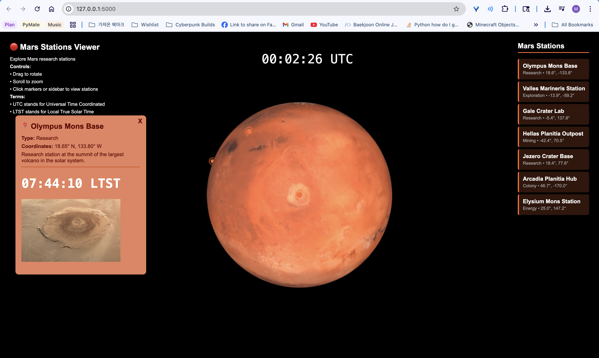

# Mission To Mars
### Hackathon project for [Crimson Hacks](https://pitch.com/v/crimson-hacks-qgy5dv/9f2a0092-3b2a-4bce-b772-971154441f9d) built with [Hyunjun](https://github.com/hja093025-arch)

We built a simple API with python to calculate the LTST (local true solar time) of anywhere in Mars. And, we use three.js library to render 3d model of Mars, and built arbitrary Mars stations at special locations like Gale Crater. Then, we used our Python API to calculate the LTST of the stations in real time.

***Example Screenshot***
